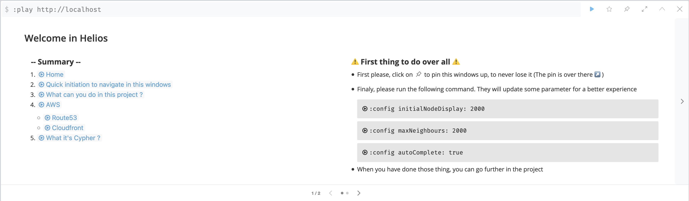
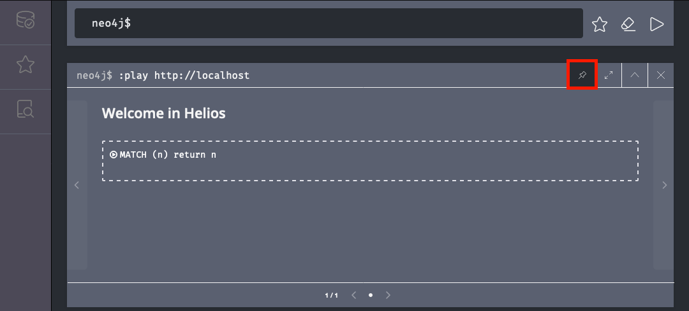

# :sunny: Helios :sunny:


Helios, is a student project about how to map a cloud infrastructure. The goal is to simplify visualization of the infrastructure between different services

## Table of contents
- [:sunny: Helios :sunny:](#sunny-helios-sunny)
  - [Table of contents](#table-of-contents)
  - [Usage](#usage)
    - [Prerequisites](#prerequisites)
    - [Help](#help)
    - [Install](#install)
    - [First Run](#first-run)
    - [Tips](#tips)
    - [Refresh or switch AWS account](#refresh-or-switch-aws-account)
    - [CMAP](#cmap)
  - [Contributing](#contributing)
  - [Versioning](#versioning)
  - [Authors](#authors)
  - [License](#license)
  - [References](#references)

## Usage

### Prerequisites
___
For this project, you need :

- Docker
- python3
- :warning: Good AWS configuration, like this :
```markdown
[default]
aws_access_key_id = <YOUR_AWS_KEY_ID>
aws_secret_access_key = <YOUR_AWS_ACCESS_KEY>
region = <AWS_REGION>
output = json

[production]
aws_access_key_id = <YOUR_AWS_KEY_ID>
aws_secret_access_key = <YOUR_AWS_ACCESS_KEY>
output = json
region = <AWS_REGION>

[development]
role_arn = arn:aws:iam::<AWS_ACCOUNT_ID>:role/<YOUR_AWS_ROLE_NAME>
source_profile = default
output = json
region = <AWS_REGION>
```

### Help
___
The code below is the result of the command `make` in the root directory. Don't hesitate to run it on your terminal !
```markdown
 Management Command
------------------------------
setup           /!\ Copy your ~/.credentials into a directoy gitignored /!\
build           Build the container
start           Start the container
stop            Clean the DB and stop the container

 Project Command
------------------------------
refresh         Refresh all data
cmap            Cloud Mapper with a DNS in entrypoint

 Debug Command
------------------------------
clean           Remove the container use for the project
bash            Access to the container throught /bin/bash
debug           Execute all test on neo4j datbase
```
###  Install
___
1. Setup your AWS Credentials

**:warning: The command bellow will copy your ~/.aws/credentials into a directoy gitignored :warning:**
```bash
make setup
```

2. Build the docker containing all you need
```bash
make build
```

### First Run
___
**1.** Start the project
```bash
make start
```

**2.** Go on your [localhost:7474](http://localhost:7474/browser/), , you should see this :


**3.** Click on `MATCH (n) RETURN n`, to see all data collect

### Tips
___
Attach the command, so it wont scroll down after each result


### Refresh or switch AWS account
___
To refresh all data or use another AWS account, male sure your `.aws/credentials`  is correct

**1.** Run the following command :
```bash
# make refresh ENV=<your environment>
make refresh ENV=dev
```
**2.** Go on your [localhost:7474](http://localhost:7474/browser/)


**3.** Click on `MATCH (n) RETURN n`, to see all data collect


### CMAP
___
**CMAP** allow to see all your ressources, start with an URL.

**1.** Run the following command :

```bash
# make cmap DNS=<your dns or url> ENV=<your environment>
make cmap DNS="toto.com" ENV=dev
```
**2.** Go on your [localhost:7474](http://localhost:7474/browser/)


**3.** Click on `MATCH (n) RETURN n`, to see all data collect

## Contributing

:warning: **Actually, you can't contribute to the project**, it will be open-source when the school project is finish.

## Versioning

We use [SemVer](http://semver.org/) for versioning. For the available versions, see the [tags on this repository](https://github.com/Bleets/helios/tags).

## Authors

* [Bleets](https://github.com/Bleets)
* [toxicz9](https://github.com/toxicz9)
* [Daigen9](https://github.com/Daigen9)
* [timotheTim](https://github.com/timotheTim)

See also the list of [contributors](https://github.com/your/project/contributors) who participated in this project.

## License

This project is licensed under the MIT License - see the [LICENSE.md](LICENSE.md) file for details

## References

* [Neo4j](https://neo4j.com/)
* [Neo4j : Docker](https://neo4j.com/developer/docker-run-neo4j/)
* [Neo4j : Custom Guide](https://neo4j.com/developer/guide-create-neo4j-browser-guide/)
* [Cypher](https://neo4j.com/developer/cypher-query-language/)
* [Docker](https://www.docker.com/)
* [Learn about Docker](https://openclassrooms.com/fr/courses/2035766-optimisez-votre-deploiement-en-creant-des-conteneurs-avec-docker)
* [Boto3](https://boto3.amazonaws.com/v1/documentation/api/latest/index.html)